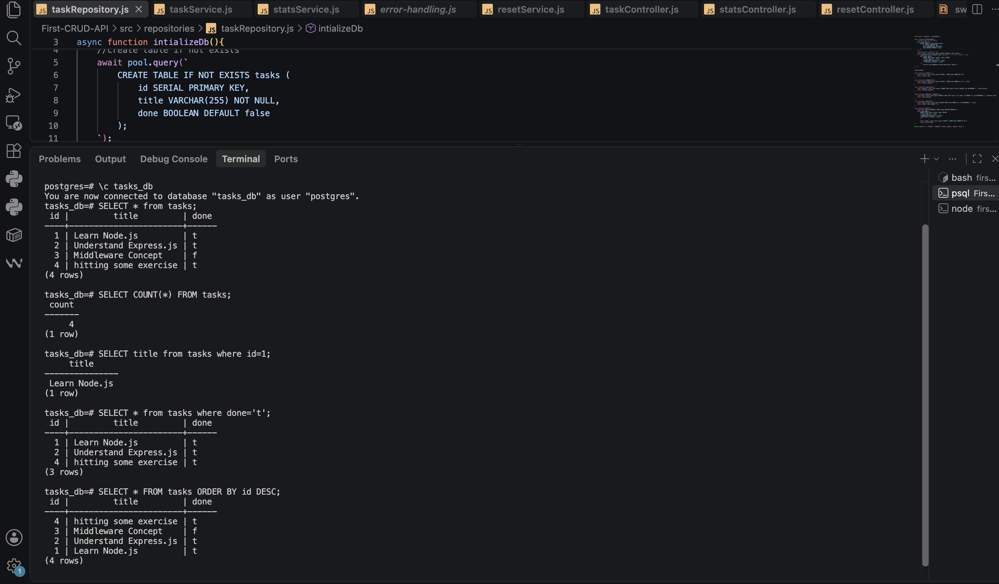

# Task CRUD API

A simple RESTful CRUD API for managing tasks, built with Node.js and Express — created step by step to learn backend fundamentals: routing, validation, status codes, and API documentation with Swagger.

## Tech Stack

- Node.js
- Express
- swagger-ui-express (interactive API docs)

## Installation & Run

```bash
git clone https://github.com/Anujakhatri/flyrank-ai.git
cd first-crud-api
npm install
npx nodemon app.js
```

Server runs at `http://localhost:3000`.
Interactive docs available at `http://localhost:3000/docs`.

## Endpoints

| Method | Endpoint      | Description                          | Success | Errors        |
|--------|---------------|---------------------------------------|---------|---------------|
| GET    | `/`           | Hello check                           | 200     | —             |
| GET    | `/health`     | Server health check                   | 200     | —             |
| GET    | `/tasks`      | List all tasks                        | 200     | —             |
| GET    | `/tasks/:id`  | Get a single task by id               | 200     | 404           |
| POST   | `/tasks`      | Create a new task                     | 201     | 400           |
| PUT    | `/tasks/:id`  | Update a task's title and/or done     | 200     | 400, 404      |
| DELETE | `/tasks/:id`  | Delete a task                         | 204     | 404           |

### Extras

| Method | Endpoint             | Description                       | Success | Errors |
|--------|-----------------------|------------------------------------|---------|--------|
| GET    | `/tasks?done=true`    | Filter tasks by done status       | 200     | —      |
| GET    | `/tasks?search=milk`  | Search tasks by title             | 200     | —      |
| GET    | `/stats`              | Task counts (total/done/open)     | 200     | —      |
| POST   | `/reset`              | Reset tasks to seed data          | 200     | —      |

#### Why POST for `/reset`?

`POST /reset` restores the task list to its original seed data. POST is used instead of GET because this endpoint **changes server state** (it clears and re-seeds the `tasks` array) — and by HTTP convention, GET must never have side effects. GET requests can be triggered accidentally by browsers, crawlers, or caches; POST cannot, which keeps state-changing actions like this one safe from accidental triggering.

## Example Request

```bash
curl -i -X POST http://localhost:3000/tasks -H "Content-Type: application/json" -d '{"title":"Buy Book"}'
```

```
HTTP/1.1 201 Created
Content-Type: application/json; charset=utf-8

{
  "id": 5,
  "title": "Buy Book",
  "done": false
}
```

```bash
curl -i -X POST http://localhost:3000/reset
```

```
HTTP/1.1 200 OK
Content-Type: application/json; charset=utf-8
```

## API Docs (Swagger UI)


Verified
All endpoints tested via curl with correct status codes (201, 200, 204, 404, 400)
Swagger UI at /docs lists every endpoint, and the full CRUD cycle works via "Try it out"
Confirmed in-memory data resets on server restart (see Mortality Experiment below)

## The Mortality Experiment

Tasks created via `POST /tasks` live only in the server's RAM. `data/tasks.js` on disk holds only the original seed data, none of the CRUD operations write back to the file. Restarting the server wipes the in-memory array, so every restart reloads the same seed data, and anything created in the previous run is gone for good. This is exactly why real applications need a database.

## Database Migration (PostgreSQL)

To solve the limitations discovered in the "Mortality Experiment", this project was migrated from in-memory arrays to a real database.

### Why PostgreSQL was chosen
PostgreSQL was chosen because it is a robust, open-source, and professional-grade relational database. Unlike in-memory arrays which lose data on restart, PostgreSQL provides permanent, persistent storage. It supports advanced SQL features, handles high concurrency perfectly for backend APIs, and is an industry standard for modern web applications.

### Where the database is stored
Unlike SQLite (which stores data in a local `.db` file in your project folder), PostgreSQL runs as a standalone server process. The data is managed by the PostgreSQL engine and stored securely in its internal system directories. Our API connects to this database server over a network port (typically `5432`) using the `pg` database driver.

### How to start the project
When you start the project, the API connects to Postgres, creates the `tasks` table automatically if it doesn't exist, and inserts seed data only if the table is empty.

1. Ensure you have a PostgreSQL server installed and running locally (or remotely).
2. Create an empty database named `tasks_db`.
3. Update your database credentials in `src/config/db.js`.
4. Run the server:
```bash
npx nodemon app.js
```
The connection will initialize automatically and your data will survive server restarts!

### Database Viewer


### Example SQL Query
Here is an example of an SQL query you can execute manually in your database viewer to count all tasks:
```sql
SELECT COUNT(*) FROM tasks;
SELECT title FROM tasks WHERE done='f';
```

## What I Learned

Building this taught me routing, middleware order, input validation as a business rule (never trust the client), correct HTTP status code usage, and describing an API with OpenAPI/Swagger.

### Why real APIs never return "everything"

Here, `GET /tasks` returns the full list by default. But real-world APIs almost never do this. Imagine a table with millions of rows — returning all of them at once means a huge response size: slow to generate on the server, slow to send over the network, and slow for the client to parse.

It's not just about display. Without pagination, the server would have to read and prepare millions of rows for every single request, even though the client only needs to show 10–20 of them on screen at a time. Pagination (`limit` and `offset`) lets the client ask for a small slice of data, so the server only does the work for that slice — saving memory, bandwidth, and processing time on both ends.

## Bugs Found: Human vs AI Code Review

When comparing the human-written version to an AI-reviewed version, four issues were caught:

| # | Bug | Problem | Fix |
|---|-----|---------|-----|
| 1 | **`.json()` on 204** | `res.status(204).json()` sends a response body on a status that [must not have one](https://www.rfc-editor.org/rfc/rfc9110#status.204) per the HTTP spec. | Changed to `res.status(204).end()` — terminates the response with no body. |
| 2 | **Mixed error property** | Service layer set `error.statusCode`, but the error-handling middleware read `err.status` — so custom status codes were silently ignored and everything fell back to `500`. | Unified to `error.status` everywhere (services + middleware). |
| 3 | **O(n) ID generation** | `Math.max(...tasks.map(t => t.id)) + 1` scanned every task on every `POST /tasks`. Harmless at 4 tasks, but O(n) per create and would also crash on an empty array (`Math.max()` returns `-Infinity`). | `taskRepository.js` now tracks a `nextId` counter — O(1) per create, and correctly resets after `POST /reset`. |
| 4 | **3-way duplicated reset logic** | The same four seed tasks were hardcoded in three separate files: `data/tasks.js`, `taskRepository.js`, and `resetService.js`. Changing one would silently leave the others stale. | `data/tasks.js` now exports a `SEED_DATA` constant as the single source of truth. `resetService.js` delegates to `taskRepository.reset()`, which deep-copies from `SEED_DATA`. |
