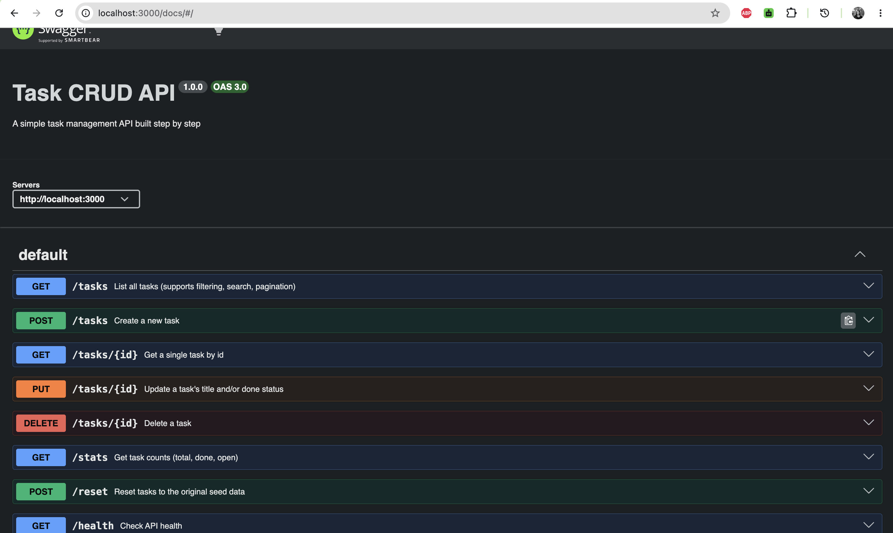

# Task CRUD API

A simple RESTful CRUD API for managing tasks, built with Node.js and Express — created step by step to learn backend fundamentals: routing, validation, status codes, and API documentation with Swagger.

## Tech Stack

- Node.js
- Express
- swagger-ui-express (interactive API docs)

## Installation & Run

```bash
git clone https://github.com/Anujakhatri/flyrank-ai.git
cd first-crud-api
npm install
npx nodemon index.js
```

Server runs at `http://localhost:3000`.
Interactive docs available at `http://localhost:3000/docs`.

## Endpoints

| Method | Endpoint      | Description                          | Success | Errors        |
|--------|---------------|---------------------------------------|---------|---------------|
| GET    | `/`           | Hello check                           | 200     | —             |
| GET    | `/health`     | Server health check                   | 200     | —             |
| GET    | `/tasks`      | List all tasks                        | 200     | —             |
| GET    | `/tasks/:id`  | Get a single task by id               | 200     | 404           |
| POST   | `/tasks`      | Create a new task                     | 201     | 400           |
| PUT    | `/tasks/:id`  | Update a task's title and/or done     | 200     | 400, 404      |
| DELETE | `/tasks/:id`  | Delete a task                         | 204     | 404           |

### Extras

| Method | Endpoint             | Description                       | Success | Errors |
|--------|-----------------------|------------------------------------|---------|--------|
| GET    | `/tasks?done=true`    | Filter tasks by done status       | 200     | —      |
| GET    | `/tasks?search=milk`  | Search tasks by title             | 200     | —      |
| GET    | `/stats`              | Task counts (total/done/open)     | 200     | —      |
| POST   | `/reset`              | Reset tasks to seed data          | 200     | —      |

#### Why POST for `/reset`?

`POST /reset` restores the task list to its original seed data. POST is used instead of GET because this endpoint **changes server state** (it clears and re-seeds the `tasks` array) — and by HTTP convention, GET must never have side effects. GET requests can be triggered accidentally by browsers, crawlers, or caches; POST cannot, which keeps state-changing actions like this one safe from accidental triggering.

## Example Request

```bash
curl -i -X POST http://localhost:3000/tasks -H "Content-Type: application/json" -d '{"title":"Buy Book"}'
```

```
HTTP/1.1 201 Created
Content-Type: application/json; charset=utf-8

{
  "id": 5,
  "title": "Buy Book",
  "done": false
}
```

```bash
curl -i -X POST http://localhost:3000/reset
```

```
HTTP/1.1 200 OK
Content-Type: application/json; charset=utf-8
```

## API Docs (Swagger UI)



Verified
All endpoints tested via curl with correct status codes (201, 200, 204, 404, 400)
Swagger UI at /docs lists every endpoint, and the full CRUD cycle works via "Try it out"
Confirmed in-memory data resets on server restart (see Mortality Experiment below)

## The Mortality Experiment

Tasks created via `POST /tasks` live only in the server's RAM. `data/tasks.js` on disk holds only the original seed data, none of the CRUD operations write back to the file. Restarting the server wipes the in-memory array, so every restart reloads the same seed data, and anything created in the previous run is gone for good. This is exactly why real applications need a database.

## What I Learned

Building this taught me routing, middleware order, input validation as a business rule (never trust the client), correct HTTP status code usage, and describing an API with OpenAPI/Swagger.

### Why real APIs never return "everything"

Here, `GET /tasks` returns the full list by default. But real-world APIs almost never do this. Imagine a table with millions of rows — returning all of them at once means a huge response size: slow to generate on the server, slow to send over the network, and slow for the client to parse.

It's not just about display. Without pagination, the server would have to read and prepare millions of rows for every single request, even though the client only needs to show 10–20 of them on screen at a time. Pagination (`limit` and `offset`) lets the client ask for a small slice of data, so the server only does the work for that slice — saving memory, bandwidth, and processing time on both ends.